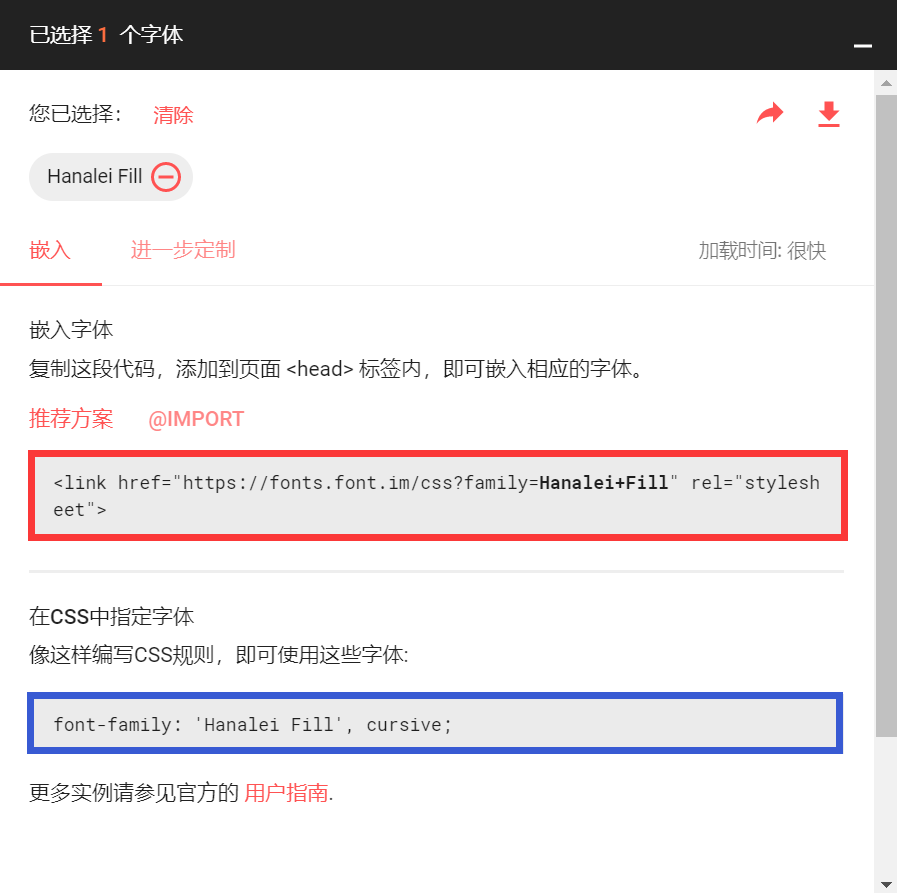
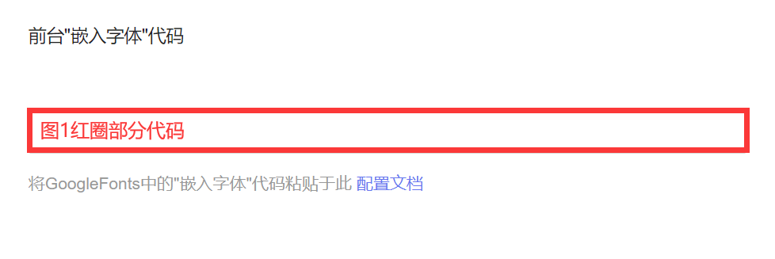
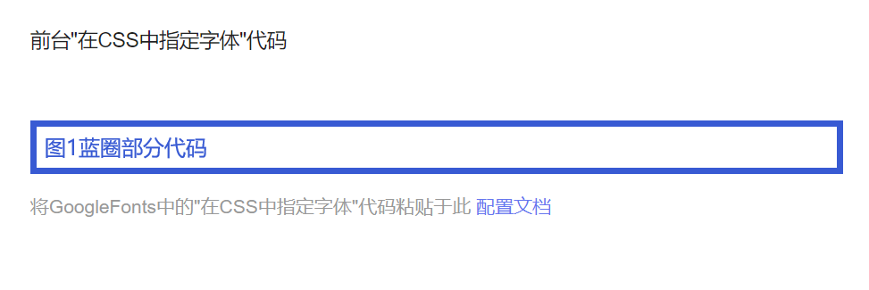
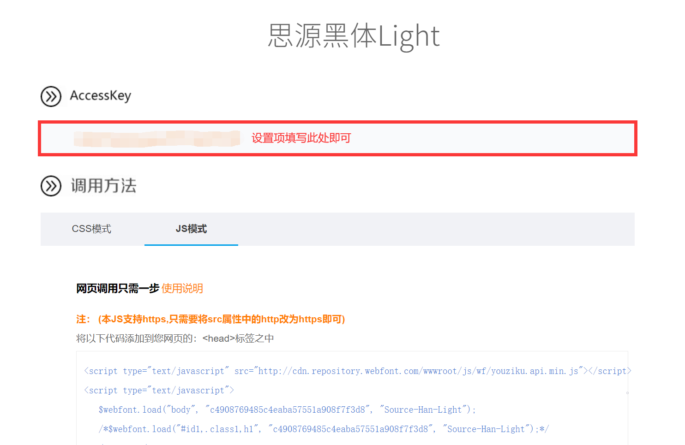
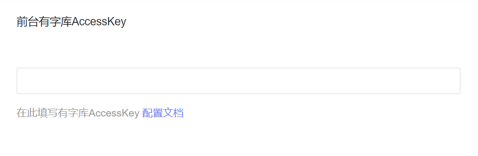

# 配置说明
## GoogleFonts配置
在`http://www.googlefonts.cn/`中挑选合适的字体，点`+`号，会弹出一个`窗口`。

将`红圈部分`代码填入`第一设置项`，将`蓝圈部分`代码填入`第二设置项`。

## 有字库配置
在`https://www.webfont.com/`中注册账户，在字体列表中挑选合适的字体，点击`立即使用`，会跳转到字体页面。将`AccessKey`填入设置项中。

## 自定义字体配置
存放字体，在插件配置中填写字体链接，如在网站本地，建议存放在根目录，其他地址可能无效果。

